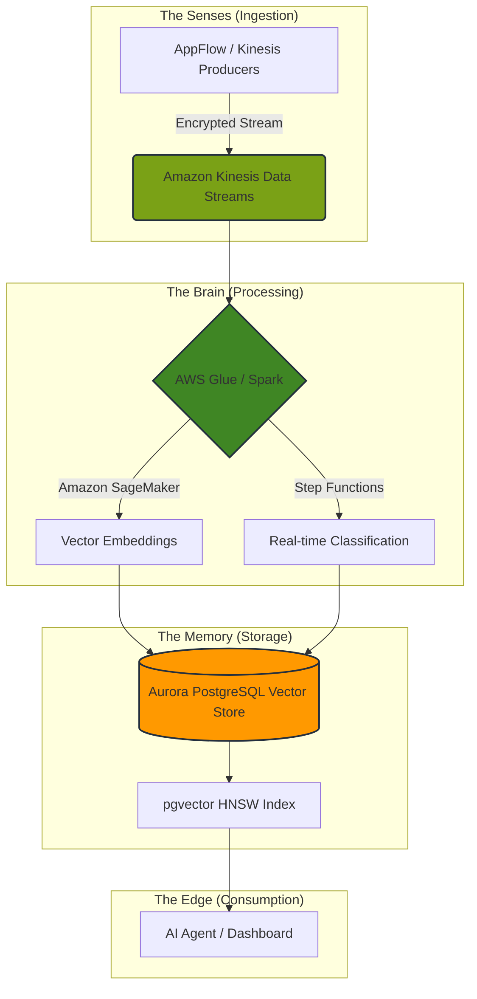

# PoC: The MIA-DoD Agentic-AWS Nervous System 🧠⚡

**Strategic Intelligent Infrastructure for Secure, Real-Time Autonomous Data Orchestration.**

## 📋 Overview
The **MIA-DoD** (Managed Intelligence Architecture) project is the 2.0 evolution of the Agentic Data Nervous System. It transitions a high-sensitivity prototype into a **Treasury-Hardened** AWS ecosystem. This system acts as a resilient, self-healing "nervous system" for sensitive telemetry, utilizing **Amazon Aurora’s** pgvector capabilities for sub-second vector search and **AWS Glue/Lambda** for autonomous, serverless processing.

---

## 🚀 The Architecture
The system follows a "Sense-Process-Remember" pattern, leveraging AWS PrivateLink to ensure data never touches the public internet.


---

# 📂 Repository Structure

```
mia-dod-nervous-system-aws/
├── terraform/          # 🏗️ IaC: Treasury-High / FedRAMP Hardening
│   ├── modules/        # Reusable IAM, KMS, & VPC Endpoint components
│   ├── main.tf         # Primary orchestrator (Aurora + Glue)
│   └── providers.tf    # AWS Region & Provider constraints
├── ingestion/          # 📡 Senses: Lambda extractors & Kinesis schemas
├── pipeline/           # 🧠 Brain: AWS Glue 4.0 (Spark/Python)
│   ├── src/            # Core transformation & SageMaker integration
│   └── setup.py        # Custom library packaging for Glue workers
├── database/           # 💾 Memory: Aurora PostgreSQL + pgvector
│   ├── migrations/     # Versioned schema changes
│   └── schema/         # Initial HNSW Index & relational setup
├── agent/              # 🤖 Agent: AI Reasoning & Recall Logic
├── docs/               # 📜 Compliance: AWS Security & Treasury SOPs
├── .env.example        # 🔑 Security: Environment template
└── README.md           # 📖 Roadmap & Documentation

```
---

# 🛠️ Tech Stack
**Ingestion:** 📡 AWS AppFlow, Amazon Kinesis Data Streams

**Stream Processing:** 🧠 AWS Glue 4.0 (Spark/Python), AWS Lambda, Amazon SageMaker

**Storage:** 💾 Amazon Aurora PostgreSQL-Compatible (Serverless v2), pgvector

**Infrastructure:** 🏗️ Terraform, Amazon Web Services (AWS)

**Security:** 🛡️ VPC Endpoints (PrivateLink), AWS KMS (CMK), IAM Permission Boundaries

# ⚙️ Quick Start

1. **Environment Setup**
   Clone the repository and prepare your local secrets:

```bash
cp .env.example .env
# Edit .env with your AWS_PROFILE and REGION
```

2. **Infrastructure Provisioning**

```bash
cd terraform
terraform init
terraform apply

```
3. **Launch the Nervous System**
   Deploy the Glue Job to begin real-time vectorization:
```bash
cd pipeline
# AWS Glue jobs are usually triggered via CLI or Console
aws glue start-job-run --job-name mia-dod-ingestion-engine
```

# 🛡️ Security & Compliance
Built specifically for **Treasury-grade** high-sensitivity workloads:

1) **Network Isolation:** Utilizes VPC Interface Endpoints to ensure all service-to-service communication stays within the AWS backbone.

2) **Encryption Sovereignty:** Uses AWS KMS with Customer Managed Keys (CMK) for double-layer encryption at rest.

3) **Identity Guardrails:** Implements IAM Permission Boundaries to ensure that even "Agentic" identities cannot escalate privileges.

4) **Auditability:** Integrates with AWS CloudTrail and CloudWatch for immutable logging of all data access events.

# 👨‍💻 Author
Alf Baez Architecting Secure & Intelligent Cloud Ecosystems
